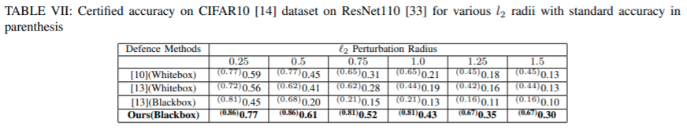
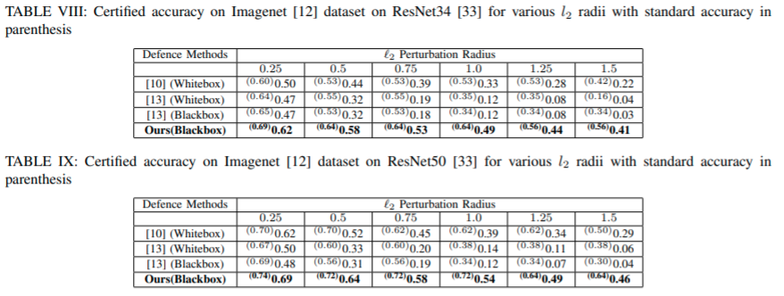

# Readme for Reproducing Results

## Quickstart:
1. install dependencies:
    ```
    $ conda create -n universal-defence python=3.6
    $ conda activate universal-defence
    $ conda install numpy matplotlib pandas seaborn scipy==1.1.0
    $ conda install pytorch torchvision cudatoolkit=10.0 -c pytorch # for Linux
    $ pip install google-cloud-vision boto3 clarifai

    ```

2. To download the pretrained models we urge the user to refer denoised-smoothing [here](https://github.com/microsoft/denoised-smoothing)

3. To train the UNet model for CIFAR10 dataset using our methodology for a standard deviation of 0.25: 
    ```
    pretrained_classifier = "path to the pretrained classification model"
    save_dir = "path for saving the weights of UNet model"
    noise_sd = 0.25
    name = "experiment name"
    python train_reconstructer.py --dataset cifar10 --pretrained $pretrained_classifier --save_dir $save_dir --noise_sd $noise_sd --name $name
    ```

4. To generate certification output for a standard deviation of 0.25 on CIFAR10 dataset for our methodology:
    ```
    pretrained_classifier="path to the pretrained classification model"
    ckpt_dir="path to UNet weight directory"
    output="path to which certification results will be saved"
    python code/certify.py --dataset cifar10 --base_classifier $pretrained_classifier --sigma 0.25 --outfile $output --skip 20 --denoiser $denoiser
    ```

5. To run the experiments for baselines we refer to denoised-smoothing [here](https://github.com/microsoft/denoised-smoothing)

6. To generate plots and tables with comparisions on our results directly run:
    ```
    python analyze.py
    ```


## Results :
CIFAR10 Results:


<br>
<br>
ImageNet Results:




